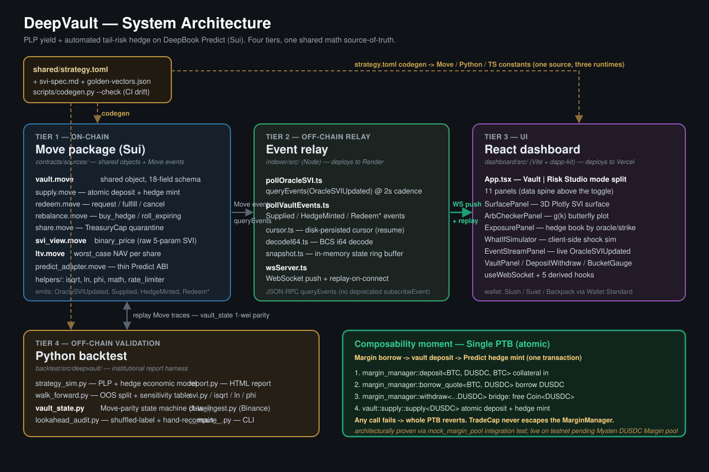

# DeepVault

> A composable structured-product vault on Sui DeepBook Predict that fuses PLP yield with automated tail-risk hedging, paired with an institutional-grade SVI volatility-surface dashboard. Built for Sui Overflow 2026.

[](https://github.com/Chimdalu-Ofoegbu/DeepVault/actions/workflows/ci.yml)
[](LICENSE)

## What is DeepVault?

DeepVault is a structured-product vault on Sui's **DeepBook Predict**. A single deposit buys you **"PLP yield minus crash insurance"**: the vault earns **PLP** (Predict Liquidity Provision) fees and, in the same flow, buys binary tail-risk hedges priced off a **live SVI** (Stochastic Volatility Inspired) volatility surface. In calm markets you collect the liquidity-provision yield; when BTC sells off hard, the hedges pay out and cushion the drawdown instead of letting it ride straight through your position.

It ships with an institutional-grade **PLP Risk Studio** dashboard that streams the same on-chain SVI surface the vault prices against — plus exposure, arbitrage checks, and a what-if hedge simulator — the kind of pre-trade risk view an LP desk expects before committing capital.

**Who it's for:** institutional LPs and DeepBook Predict liquidity providers who want PLP yield but cannot carry naked tail risk — and the DeepBook ecosystem itself, as a worked example of protocol-layer composability (the "third primitive in the DeepBook stack"). Built for **Sui Overflow 2026's DeepBook specialized track**.

> **Read this first.** The codebase is **not audited**, mainnet deploy is **deferred to post-submission**, and the vault carries one significant architectural limitation under Predict's ownership model. See [Known limitations](#known-limitations-pre-mainnet) before treating anything here as production-ready.

## How it works

You deposit a quote asset (testnet **DUSDC**). The vault then:

- routes **~90%** to DeepBook Predict's **PLP** book to earn liquidity-provision fees, and
- spends **~10%** on **binary tail hedges**, priced from a live SVI volatility surface (Gatheral & Jacquier 2014).

When BTC falls more than **~15%** (the hedge strike), the hedges pay out and cushion the loss. In calm markets, you keep the PLP fees minus the smaller cost of carrying the hedges. That trade-off — yield in exchange for a steady insurance premium — *is* the product.

The hedge policy is **locked at 10% allocation / −15% OTM / 14-day tenor / fixed sizing** ([`docs/HEDGE-POLICY.md`](docs/HEDGE-POLICY.md)), frozen against hindsight tuning.

> **Honest caveat:** the backtest assumes a conservative **8% PLP APY** — a modeling assumption, **not** a measured Predict yield (see the whitepaper's [model-assumptions section](docs/WHITEPAPER.md#6-model-assumptions)).

**The composability moment.** The flagship target is a single **PTB** (Programmable Transaction Block) that opens three positions atomically — a Margin borrow + the vault deposit + the Predict hedge mint. The live testnet demo (`make demo`) performs a **real on-chain deposit + Predict hedge mint atomically**, then redeems. The full three-leg Margin + Predict + vault PTB is **architecturally proven via the `mock_margin_pool` integration test** and is **pending a live testnet Margin pool** (there is no DUSDC Margin pool on Sui testnet yet — see [Demo](#demo)). Together these show what "Sui composability" means at the protocol layer.

## What you get

DeepVault is three coordinated pieces:

1. **The vault — on-chain.** A Sui Move package (`deepvault::`): deposit / redeem / rebalance with an **atomic on-chain hedge mint**, a token-bucket withdrawal limiter, inflation-attack defense, and worst-case-LTV accounting. **Live on Sui testnet since 2026-05-16** ([addresses below](#testnet-contracts)).
2. **PLP Risk Studio — dashboard.** A React + Vite app with a `Vault | Risk Studio` mode split and **11 panels**: a **live 3D SVI surface**, an arbitrage-violation checker, per-oracle exposure, a **what-if hedge simulator**, a live event stream, and the deposit/withdraw flow — all fed by the same on-chain SVI updates the vault prices against. *(Live at <https://deep-vault-dashboard.vercel.app> — also runs locally via `pnpm dev`.)*
3. **Backtest harness — Python.** A **365-day walk-forward** with an **out-of-sample (OOS) holdout** and a **lookahead-bias audit**, producing the published, window-labeled performance numbers below.

## Performance (honest)

Every published figure is window-labeled and sourced in [`NUMBERS-CANONICAL.md`](.planning/phases/06-submission-package/NUMBERS-CANONICAL.md):

- **Full-window 365-day total return: `+7.52%`** — one −15% breach fired during the window, and the hedges earned their keep.
- **Calm out-of-sample holdout: `−2.30%` APY, Sharpe `−1.87`** — the honest cost-of-carry of crash insurance when no breach occurs.

The two numbers *are* the story: in a window containing a crash, the hedge pays for itself; in a calm window, you pay a steady premium for protection you didn't end up needing. Full 365-day walk-forward with OOS holdout and PnL attribution: [`backtest/reports/full-365d-report.html`](backtest/reports/full-365d-report.html). All backtest numbers in the whitepaper are likewise window-labeled — see [`docs/WHITEPAPER.md`](docs/WHITEPAPER.md).

## Known limitations (pre-mainnet)

**Not audited; mainnet deferred.** The codebase is **not** audited. DeepBook Predict has not shipped on mainnet during the submission window (per Mysten's "later in 2026" timeline; testnet launched 2026-05-05), so DeepVault's mainnet deploy is **deferred to post-submission** — see [`docs/MAINNET-READINESS.md`](docs/MAINNET-READINESS.md).

**Per-supplier hedge custody (the main architectural limitation).** DeepBook Predict gates `mint`/`redeem` on `ctx.sender() == manager.owner()`, and a shared `Vault` object is never a transaction sender — so the vault cannot own a `PredictManager`. The project's WAVE-0 spike (`contracts/tests/_spike/predict_manager_owner_spike_test.move`) proved this, so DeepVault deliberately uses **supplier-owned** managers: each deposit's hedge is custodied in the **depositor's own** PredictManager, and settlement proceeds settle back to that supplier's manager rather than being **pooled into the vault**. The vault's NAV therefore carries the hedge leg at **cost basis** and does not yet custody or reconcile hedge proceeds; true pooled vault-custody is pre-mainnet work (needs a Predict-side capability API or an architecture redesign). Full disclosure: [`docs/WHITEPAPER.md` §8.1](docs/WHITEPAPER.md#81-known-limitation--hedge-custody-under-predicts-ownership-model-pre-mainnet).

## Status

**Submission-ready for Sui Overflow 2026 (DeepBook track).** Phases 0 through 5 are complete plus the PLP Risk Studio dashboard (Phase 04.1 reskin + Phase 04.2 `Vault | Risk Studio` mode split):

- **Phase 0 — Setup & Ground Rules:** monorepo scaffolded, single-source `shared/strategy.toml` codegen to Move/Python/TS, 5-job CI matrix, policy docs locked, DeepBookV3 fork vendored at SHA `1159d79a`, hedge-ratio policy frozen (10% / -15% OTM / 14-day tenor / fixed sizing).
- **Phase 1 — Math Foundation:** three-runtime raw 5-param SVI evaluator (Move + Python + TypeScript) gated by 141 bit-for-bit golden vectors (21 from Gatheral & Jacquier 2014).
- **Phase 2 — Vault Move package:** deposit / redeem / rebalance with atomic on-chain hedge mint, token-bucket withdrawal limiter, inflation defense, worst-case LTV. **Deployed to Sui testnet 2026-05-16** (addresses below).
- **Phase 3 — Backtest + two-protocol PTB:** 365-day walk-forward with OOS holdout + lookahead-bias audit; the 5-call Margin+Predict+vault single-PTB shape proven via the `mock_margin_pool` integration test.
- **Phase 4 — Dashboard:** React + Vite SVI Risk Studio (11 panels: 3D SVI surface (live data; hosted on Vercel at <https://deep-vault-dashboard.vercel.app> + also runs locally via `pnpm dev`), arb-checker, exposure, what-if simulator, event stream) with a `Vault | Risk Studio` mode split.
- **Phase 5 — Testnet hardening + mainnet-readiness toolkit:** `make demo` smoke test green end-to-end with a dual ±10 bps NAV gate; the mainnet toolkit is committed and lint-clean for a post-submission deploy.

**Ship target:** 2026-06-16 (Sui Overflow 2026 submission). Hard ship: 39 days from 2026-05-09. Code freeze: 2026-05-30.

## Glossary

- **PLP** — Predict Liquidity Provider; the LP role inside DeepBook Predict's binary-options venue.
- **SVI** — Stochastic Volatility Inspired; a 5-parameter volatility-surface parameterization (Gatheral & Jacquier 2014).
- **Vault share** — `Coin<VAULT_SHARE>` representing pro-rata claim on vault NAV.
- **PTB** — Programmable Transaction Block; Sui's atomic multi-call primitive.
- **Hedge ratio** — Fraction of each new deposit routed to the hedge book (locked at 10% per `docs/HEDGE-POLICY.md`).
- **NAV** — Net Asset Value per share, anchored to the vault's liquid quote balance + the hedge leg at **cost basis** (the vault does not pool or reconcile hedge proceeds in v1 — see [Known limitations](#known-limitations-pre-mainnet)).

## Quick Start

The repo is public at <https://github.com/Chimdalu-Ofoegbu/DeepVault>. From a fresh clone, this sequence works end-to-end:

```bash
git clone https://github.com/Chimdalu-Ofoegbu/DeepVault.git
cd DeepVault

# Install all toolchains (Move, TS, Python) — see docs/DEV-BOOTSTRAP.md if first time
make install

# Regenerate strategy_constants from shared/strategy.toml
make codegen

# Run all tests (Move + TS Vitest + Python pytest)
make test

# Run lints + format checks
make lint
```

If `make` is not on PATH (Windows), use the underlying commands directly:

```bash
pnpm install --frozen-lockfile
(cd backtest && uv sync --locked)
(cd backtest && uv run --no-project python ../scripts/codegen.py)
pnpm -r run test && (cd backtest && uv run pytest)
pnpm -r run lint && (cd backtest && uv run ruff check .)
```

If any step fails, see `docs/DEV-BOOTSTRAP.md` for one-shot machine setup (Sui CLI, pnpm, uv, wallets).

## Stack

Pinned toolchain (every version is exact, no `^`/`~` drift):

- **Sui CLI** `mainnet-v1.71.1` (Move 2024.beta edition)
- **DeepBookV3** `predict-testnet-4-16` @ `1159d79af33c70e09e406310e1d8f067832ede9d` (vendored via git subtree at `scripts/deepbookv3/`)
- **Node.js** `>=22 LTS` + **pnpm** `10.0.0` (workspaces; indexer + dashboard implemented in Phase 4, run locally)
- **Python** `>=3.12` via **uv** (numpy 2.4 / pandas 3.0 / scipy 1.17 / pyarrow 24 / matplotlib 3.10)
- **CI:** GitHub Actions, Ubuntu latest, 5-job matrix (move, ts, python, codegen-drift, parity)

Full stack rationale, alternatives rejected, and version-compatibility flags: see [`.planning/research/STACK.md`](.planning/research/STACK.md) and [`CLAUDE.md`](CLAUDE.md).

## Demo

```bash
# Reproduces the full testnet vault cycle end-to-end:
# deposit -> hedge mint -> redeem_request -> 1h cooldown -> redeem_fulfill
# with a dual ±10 bps NAV verification gate. Takes ~1h wall-clock.
#
# Requires SUI_PRIVATE_KEY (ephemeral testnet keypair) and ORACLE_SVI_ID
# (BTC-USD OracleSVI shared object id) env vars. See docs/DEV-BOOTSTRAP.md
# for setup. Phase 6 records the demo video against this same flow.
SUI_PRIVATE_KEY=<...> ORACLE_SVI_ID=<...> make demo
```

Or, equivalently:

```bash
bash scripts/testnet-smoke-test.sh
```

The 7 staged `[CHECKPOINT PASS]` markers + the final dual-gate verdict (`ratio_bps=...` Gate A + `nav_delta_bps=...` Gate B, both annotated `OK`) confirm a green run. Phase 6 records the demo video against this same `make demo` flow.

**What `make demo` exercises (honest scope):** a `vault::supply` call (atomic deposit + a **real on-chain Predict hedge mint**, emitting `Supplied` + `HedgeMinted`), then `redeem_request` → 1h cooldown → `redeem_fulfill`. The flagship two-protocol single-PTB (Margin borrow + Predict + vault hedge share, atomic) is **architecturally proven via the `mock_margin_pool` integration test** and documented as **live-on-testnet pending** — there is no DUSDC Margin pool on Sui testnet yet, so the live Margin leg cannot be filmed today (the demo does **not** claim a live Margin PTB). `ORACLE_SVI_ID` is the BTC-USD `OracleSVI` shared object from the Mysten Predict testnet registry — not a value you deploy.

### Testnet contracts

Live on Sui testnet since **2026-05-16**, captured verbatim in [`.planning/phases/02-vault-move-package-testnet-deploy/TESTNET-DEPLOY.json`](.planning/phases/02-vault-move-package-testnet-deploy/TESTNET-DEPLOY.json):

| Object | Sui testnet explorer |
|--------|---------------------|
| `deepvault` package | [`0xbc9aaeaa…d6e862`](https://suiscan.xyz/testnet/object/0xbc9aaeaa237400179e4c55cf49209dcf6ed0492be6eeb0088677e754ebd6e862) |
| Vault shared object | [`0x2824d97e…f7a911`](https://suiscan.xyz/testnet/object/0x2824d97e221413660fd9f8e23155bd4d1d459c06a893b1d350eb279c3bf7a911) |
| AdminCap | [`0x9e40150e…aba3e7`](https://suiscan.xyz/testnet/object/0x9e40150e07ce223019afbaca425cb08b84c541ad402b428ee4a9942dfaaba3e7) |
| Deploy tx | [`ETYPnLemp…uBBCS`](https://suiscan.xyz/testnet/tx/ETYPnLemp761HsXeWigdh7h5hMvqEa2id4KDm8auBBCS) |

`make demo` consumes the same `TESTNET-DEPLOY.json`, so the deployed vault above is exactly what the smoke test exercises.

## Architecture at a Glance

| Doc | Purpose |
|-----|---------|
| [`.planning/PROJECT.md`](.planning/PROJECT.md) | Scope, core value, cut-lines, key decisions |
| [`.planning/ROADMAP.md`](.planning/ROADMAP.md) | 7-phase plan (Setup → Math → Vault → Backtest+PTB → Dashboard → Mainnet → Submission), success criteria, hard policy locks |
| [`CONTRIBUTING.md`](CONTRIBUTING.md) | Five hard policy locks: code freeze, no-refactor, no-dashboard-before-vault, hedge ratio, weekly Monday sweep |
| [`docs/HEDGE-POLICY.md`](docs/HEDGE-POLICY.md) | Locked hedge-ratio ADR (10% / -15% OTM / 14-day / fixed) — strategy frozen against hindsight tuning |
| [`docs/WHITEPAPER.md`](docs/WHITEPAPER.md) | Strategy whitepaper: SVI math, binary hedge-price formula, sizing bounds, worst-case liquidation, risk disclosures (all backtest numbers window-labeled) |
| [`docs/MAINNET-READINESS.md`](docs/MAINNET-READINESS.md) | Why mainnet is deferred + the post-submission ≤30-min deploy procedure (preserves the original funding playbook: budget, two-wallet split, AdminCap discipline) |
| [`docs/CI-BRANCH-PROTECTION.md`](docs/CI-BRANCH-PROTECTION.md) | One-time GitHub setup: 5 required status checks, UI + gh CLI paths |
| [`docs/DEV-BOOTSTRAP.md`](docs/DEV-BOOTSTRAP.md) | One-shot dev-machine setup (Sui CLI, pnpm, uv, wallets) |

```
shared/strategy.toml ──> codegen.py ──┬──> contracts/sources/strategy_constants.move
                                      ├──> backtest/src/deepvault/strategy_constants.py
                                      └──> dashboard/src/lib/strategy_constants.ts

vault::supply / redeem / rebalance ──> predict::supply / mint
                                  └──> oracle_svi::OracleSVIUpdated event ──> indexer ──ws──> dashboard
```

Full architecture diagram — the four tiers (Move package · event relay/indexer · React dashboard · Python backtest) with data-flow arrows and the two-protocol single-PTB composability moment:



[`docs/architecture.svg`](docs/architecture.svg) is committed (GitHub-renderable, no build step). For the prose deep-dive see [`.planning/research/ARCHITECTURE.md`](.planning/research/ARCHITECTURE.md).

## Repository layout

| Path | Purpose | Phase |
|------|---------|-------|
| `contracts/` | Sui Move package (`deepvault::`) | Phase 0 + 2 |
| `indexer/` | Node.js event relay | Implemented (Phase 4); runs locally |
| `dashboard/` | React + Vite SVI Risk Studio | Implemented (Phase 4); runs locally |
| `backtest/` | Python uv project, lookahead audit | Phase 0 + 1 + 3 |
| `shared/` | `strategy.toml` (source of truth), `golden-vectors.json` | Phase 0 + 1 |
| `scripts/` | `codegen.py`, `predict-diff.sh`, vendored DeepBookV3 fork | Phase 0 |
| `config/` | `testnet.toml`, `mainnet.toml` (TBD slots filled in Phases 2/5) | Phase 0 |
| `docs/` | CONTRIBUTING, HEDGE-POLICY, MAINNET-READINESS, DEV-BOOTSTRAP, CI-BRANCH-PROTECTION, WHITEPAPER, architecture.svg | Phase 0 + 6 |
| `.github/workflows/` | CI (5-job matrix) + Monday Predict sweep cron | Phase 0 |

## Hosting

| Component | Tier | URL |
|-----------|------|-----|
| Dashboard (React + Vite) | **Live — Vercel** | <https://deep-vault-dashboard.vercel.app> |
| Event relay (Node.js + WS) | **Live — Render** (free tier; sleeps ~15 min idle) | `wss://deepvault-relay.onrender.com` |
| Sui RPC (testnet) | Public Mysten | `https://fullnode.testnet.sui.io:443` |
| Sui RPC (mainnet, Phase 5) | Public Mysten | `https://fullnode.mainnet.sui.io:443` |

The dashboard is **live on Vercel** at <https://deep-vault-dashboard.vercel.app> (static build — always up) and the event relay is **live on Render's free tier** at `wss://deepvault-relay.onrender.com`. Both also run locally (`pnpm dev` / `node`); see [Quick Start](#quick-start). **Honest free-tier caveat:** the Render relay sleeps after ~15 min idle, so the first load after idle cold-boots (~30–60s); the dashboard reconnects automatically (a brief RECONNECTING pill, never a broken UI), and a [keepalive workflow](.github/workflows/keepalive-relay.yml) pings it during the demo window. For a guaranteed-warm demo, open the dashboard ~1 min ahead.

## Mainnet readiness

DeepBook Predict mainnet has not shipped during the submission window (per Mysten's "later in 2026" timeline; testnet launched 2026-05-05). DeepVault's mainnet deploy is **deferred to post-submission**.

The mainnet toolkit is committed and lint-clean — when Predict ships on mainnet, the post-submission operator runs a ≤30-minute deploy procedure:

```bash
bash scripts/predict-mainnet-check.sh   # Verify Predict shipped on mainnet
bash scripts/preflight.sh                # Verify config + tests
bash scripts/mainnet-deploy.sh           # Publish + create_vault
bash scripts/mainnet-smoke-test.sh       # ~$50 USDsui round-trip
```

Full procedure + rationale: [`docs/MAINNET-READINESS.md`](docs/MAINNET-READINESS.md).

The architecture is **mainnet-compatible via a single config flip** in [`config/mainnet.toml`](config/mainnet.toml) — no Move/TS/Python code changes required.

## Key policies (locked in writing)

- **Hedge-ratio policy** (10% allocation, -15% OTM, 14-day tenor, fixed sizing): `docs/HEDGE-POLICY.md`
- **Code freeze** (2026-05-30): `CONTRIBUTING.md §"Code freeze: 2026-05-30"`
- **No refactor after vault ships** (Pitfall 18 mitigation): `CONTRIBUTING.md §"No refactor after vault ships"`
- **No dashboard before vault** (Pitfall 19 mitigation): `CONTRIBUTING.md §"No dashboard work before vault feature-complete"`
- **Weekly Monday Predict sweep** (Pitfall 6 mitigation): `CONTRIBUTING.md §"Weekly Monday Predict sweep"`
- **Mainnet redeploy mechanical playbook**: `docs/MAINNET-READINESS.md`

## Build log

Append-only weekly bullets per `CONTRIBUTING.md` build-log discipline. Never edit history; never delete entries.

### Week 1 (2026-05-09 to 2026-05-15)

- **Phase 0 (Setup & Ground Rules) completed** — 8 plans (00-01 through 00-08), 27 atomic task commits, 3 documented human-action checkpoints, all 8 SETUP-01..08 requirements closed (see `.planning/phases/00-setup-ground-rules/00-08-SUMMARY.md` for the closure traceability matrix).
- Toolchains pinned: Sui CLI `mainnet-v1.71.1`, Move 2024.beta, Node 22 LTS, pnpm 10, Python 3.12, uv 0.5+.
- DeepBookV3 vendored at `scripts/deepbookv3/` via `git subtree --squash` (HEAD `1159d79af33c70e09e406310e1d8f067832ede9d`); Move.toml SHA-pinned to the same commit.
- Hedge-ratio policy committed: 10% allocation, -15% OTM, 14-day tenor, fixed sizing — frozen until Phase 3 backtest re-tune (then permanent).
- Three-way constant parity wired: `shared/strategy.toml` codegen emits Move/Python/TS constants with CI drift detection.
- 5-job CI matrix landed: move + ts + python + codegen-drift + parity. Branch-protection guide ready for one-time GitHub setup.
- Two-wallet split documented: testnet dev + mainnet deploy (UNFUNDED until Phase 5).
- Slack remaining: 37 days (Day 2 of 39).

### Weeks 2–4 (2026-05-16 to 2026-06-08)

- Phases 1–4 completed (math foundation, vault Move package + testnet deploy, backtest + two-protocol PTB, dashboard). Per-phase scope and status are summarized under [Status](#status); detailed artifacts live in `.planning/phases/0{1,2,3,4}-*`. (This build log is intentionally terse for these weeks; the phase directories are the system of record.)

### Week 5 (2026-06-09 to 2026-06-15)

- **Phase 5 (Testnet Demo Hardening + Mainnet-Readiness Toolkit) completed** — testnet smoke test green end-to-end with dual ±10 bps NAV verification; mainnet-readiness toolkit (preflight + predict-mainnet-check + mainnet-deploy + mainnet-smoke-test) committed and lint-clean, ready to invoke post-submission when DeepBook Predict ships on mainnet.
- `scripts/testnet-smoke-test.sh` (judge-facing): staged 7-checkpoint cycle, $50-equivalent DUSDC, per-depositor return ratio >= 99.9% AND vault NAV drift <= 10 bps. Reproducible via `make demo`.
- `shared/strategy.toml` extended with `[redemption].cooldown_ms = 3_600_000`; codegen propagates to Move/Python/TS; `redeem.move` no longer holds a local const.
- `docs/MAINNET-READINESS.md` rewritten: judges read "why deferred"; the post-submission operator reads "<=30-min deploy procedure"; original funding playbook preserved.
- DEPLOY-01 through DEPLOY-04 + DEPLOY-09 closed per the Phase 5 reshape.

## References

- **For developers:** `docs/DEV-BOOTSTRAP.md` (one-shot setup), `CONTRIBUTING.md` (rules)
- **For judges:** [What is DeepVault?](#what-is-deepvault) + [How it works](#how-it-works) above, [`docs/WHITEPAPER.md`](docs/WHITEPAPER.md) (SVI math + strategy), [`docs/HEDGE-POLICY.md`](docs/HEDGE-POLICY.md) (strategy lock), [`backtest/reports/full-365d-report.html`](backtest/reports/full-365d-report.html) (365-day walk-forward, OOS holdout, PnL attribution), demo video (Phase 6)
- **For backtest numbers:** see [Performance (honest)](#performance-honest) above; every published figure is window-labeled and sourced in [`NUMBERS-CANONICAL.md`](.planning/phases/06-submission-package/NUMBERS-CANONICAL.md).
- **For deploy:** `docs/MAINNET-READINESS.md` (why-deferred + post-submission playbook), `docs/CI-BRANCH-PROTECTION.md` (one-time CI setup)
- **For research:** `.planning/research/SUMMARY.md`, `.planning/research/STACK.md`, `.planning/research/PITFALLS.md`
- **For roadmap:** `.planning/ROADMAP.md`, `.planning/REQUIREMENTS.md`

## License

MIT — see [LICENSE](LICENSE).

---

*MIT licensed · Sui Overflow 2026 DeepBook track · Built solo · Hard ship: 2026-06-16 · Code freeze: 2026-05-30.*
